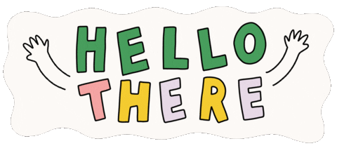

<!--Uploading welcome gif -->

 

<!-- Actual text -->

# Hi all, thanks for stopping by!

## *A little bit about me...*

🌷  **Pronouns** -- 
> she/her/hers

🌟  **Past** -- 
> graduated from the University of Oregon in June of 2020 with honors in Psychology and minors in Special Education and Women's Gender and Sexuality Studies. 

🌲  **Present** -- 
> working as Project Coordinator in the Developmental Social Neuroscience lab at the UO!

☀️  **Future** -- 
> applying to PhD programs this fall!

🧠  **Interests** -- 
> socioemotional development, education, neuroscience, community-based interventions and preventions, data science

You can find me on [![Twitter][1.2]][1], or on [![LinkedIn][3.2]][2].

<!-- Icons -->

[1.2]: 
[3.2]: https://raw.githubusercontent.com/MartinHeinz/MartinHeinz/master/linkedin-3-16.png (LinkedIn icon without padding)

<!-- Links to social media accounts -->

[1]: https://twitter.com/clarefmccann
[2]: https://www.linkedin.com/in/clare-mccann-9a5172192/

<!-- Actual Text -->

Feel free to reach out -- cmccann2@uoregon.edu

<!-- Github Stats -->

